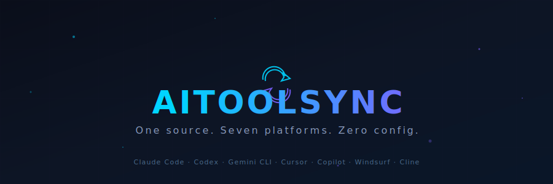

<p align="center">
  
</p>

<p align="center">
  <a href="https://github.com/EvanL1/aitoolsync/actions/workflows/ci.yml"></a>
  <a href="https://www.npmjs.com/package/aitoolsync"></a>
  <a href="https://opensource.org/licenses/MIT"></a>
</p>

<p align="center">English | <a href="README.zh-CN.md">中文</a></p>

```
.agents/              →    CLAUDE.md                        (Claude Code)
├── AGENTS.md         →    AGENTS.md                        (Codex CLI)
├── rules/            →    GEMINI.md                        (Gemini CLI)
├── skills/           →    .claude/skills/*/SKILL.md        (Claude/Codex/Gemini)
├── agents/           →    .cursor/rules/*.mdc              (Cursor)
└── platforms/        →    .github/instructions/             (Copilot)
    └── claude/       →    .windsurf/rules/                  (Windsurf)
        ├── settings.json     →    .clinerules              (Cline)
        ├── .mcp.json
        ├── hooks/
        └── plugins/
```

**One source of truth. Seven platforms. Zero dependencies.**

## The Problem

You maintain `CLAUDE.md` for Claude Code, `.cursorrules` for Cursor, `copilot-instructions.md` for Copilot… and they're all slightly different versions of the same rules. When you update one, you forget the others. When a teammate joins, half the configs are stale.

`aisync` fixes this: write your rules once in `.agents/`, and sync to all platforms with one command. File extensions are auto-converted (`.md` → `.mdc` for Cursor, `.instructions.md` for Copilot). Skills are synced as `<name>/SKILL.md` directories for platforms that support it.

## Install

### npm (recommended)

```bash
npm install -g aitoolsync
```

### Cargo (all platforms)

```bash
cargo install --git https://github.com/EvanL1/aitoolsync
```

### Homebrew (macOS / Linux)

```bash
brew tap EvanL1/aitoolsync
brew install aisync
```

### Shell script (macOS / Linux / WSL)

```bash
curl -fsSL https://raw.githubusercontent.com/EvanL1/aitoolsync/master/install.sh | bash
```

### Manual download

Download from [Releases](https://github.com/EvanL1/aitoolsync/releases):

| Platform | File |
|----------|------|
| macOS Apple Silicon | `aisync-darwin-aarch64.tar.gz` |
| macOS Intel | `aisync-darwin-x86_64.tar.gz` |
| Linux x86_64 | `aisync-linux-x86_64.tar.gz` |
| Linux ARM64 | `aisync-linux-aarch64.tar.gz` |
| Windows x64 | `aisync-windows-x86_64.zip` |

## Quick Start

```bash
aisync init                  # create .agents/ with starter AGENTS.md
aisync import claude         # pull existing Claude Code config (optional)
# edit .agents/AGENTS.md and .agents/rules/
aisync sync                  # push to all 7 platforms
```

**That's it.** Your rules now work everywhere.

## Real-World Workflow

```bash
# Team lead writes rules once
vim .agents/rules/code-style.md

# Push to all AI tools in ~2ms
aisync sync

# Preview before writing (safe mode)
aisync sync --dry-run

# Only sync specific platforms
aisync sync cursor copilot

# Sync to remote dev machines (LAN)
aisync serve                           # on config server
aisync pull http://192.168.1.100:9753  # on dev machines

# Or push via SSH
aisync remote add devbox deploy@192.168.1.10
aisync remote push devbox
```

## Source Layout

```
.agents/
├── AGENTS.md          # Root instructions → synced to each platform's convention
├── rules/             # Shared rules (auto-converted per platform)
│   ├── coding-style.md    → .claude/rules/coding-style.md
│   ├── coding-style.md    → .cursor/rules/coding-style.mdc
│   └── coding-style.md    → .github/instructions/coding-style.instructions.md
├── skills/            # Shared skills (auto-converted to directory format)
│   └── deploy.md          → .claude/skills/deploy/SKILL.md
│                          → .codex/skills/deploy/SKILL.md
│                          → .gemini/skills/deploy/SKILL.md
├── agents/            # Shared agent definitions (supports subdirectories)
│   ├── planner.md         → .claude/agents/planner.md
│   └── _shared/           → .claude/agents/_shared/
└── platforms/         # Platform-specific runtime configs
    └── claude/
        ├── settings.json  → ~/.claude/settings.json
        ├── .mcp.json      → ~/.claude/.mcp.json
        ├── hooks/         → ~/.claude/hooks/
        ├── plugins/       → ~/.claude/plugins/
        └── output-styles/ → ~/.claude/output-styles/
```

## Platform Mapping

| Platform | Root MD | Rules Dir | Rules Ext | Skills Dir | Extras |
|----------|---------|-----------|-----------|------------|--------|
| **Claude Code** | `CLAUDE.md` | `.claude/rules/` | `.md` | `.claude/skills/*/SKILL.md` | settings.json, .mcp.json, hooks/, plugins/, output-styles/ |
| **Codex CLI** | `AGENTS.md` | `.codex/rules/` | `.md` | `.codex/skills/*/SKILL.md` | — |
| **Gemini CLI** | `GEMINI.md` | — | — | `.gemini/skills/*/SKILL.md` | — |
| **Cursor** | `.cursorrules` | `.cursor/rules/` | `.mdc` | — | — |
| **Copilot** | `.github/copilot-instructions.md` | `.github/instructions/` | `.instructions.md` | — | — |
| **Windsurf** | `.windsurfrules` | `.windsurf/rules/` | `.md` | — | — |
| **Cline** | `.clinerules` | — | — | — | — |

`AGENTS.md` is always synced to project root as the [universal standard](https://agents.md/).

## Commands

```bash
aisync init                    # Create .agents/ source directory
aisync import <platform>       # Import existing config into .agents/
aisync sync [platform...]      # Sync to all (or specific) platforms
aisync sync --dry-run          # Preview what would be synced
aisync user                    # Sync to user-level (~/.claude/ etc.)
aisync status                  # Show source and target status
aisync serve [--port 9753]     # Start config server for LAN pull
aisync pull <url>              # Pull .agents/ from a config server
aisync remote add <alias> <user@host>  # Register SSH remote
aisync remote push [alias]     # Push .agents/ to remote via SSH
aisync remote list             # List registered remotes
aisync platforms               # List supported platforms
```

## Remote Sync (LAN / SSH)

For teams on internal networks or air-gapped environments:

**Config Server (C/S model):**
```bash
# On the config server
aisync serve --port 9753

# On any dev machine
aisync pull http://config-server:9753
```

**SSH Push:**
```bash
aisync remote add devbox deploy@192.168.1.10
aisync remote push devbox          # rsync + ssh aisync sync
aisync remote push --all           # push to all remotes
```

Config server defaults to port **9753** (override with `--port`). Remotes are stored in `.agents/remotes.toml`. SSH uses `rsync` (falls back to `scp`), with `BatchMode=yes` and `ConnectTimeout=10` by default.

## Should I commit the generated files?

**Yes.** Commit both `.agents/` (your source of truth) and the generated platform files (`.claude/`, `.cursor/`, `.github/`, etc.). They're all just markdown — no binaries, no build artifacts. This way, every teammate and CI environment gets the right configs without needing to install aitoolsync.

## How It Works

1. **Read** `.agents/` source directory (`.md` files + platform extras)
2. **Convert** extensions per platform (`.md` → `.mdc` for Cursor, `.instructions.md` for Copilot)
3. **Convert** skills to directory format (`deploy.md` → `deploy/SKILL.md`) for Claude/Codex/Gemini
4. **Copy** platform-specific configs from `.agents/platforms/<name>/` (settings, hooks, plugins, etc.)
5. **Write** to each platform's expected directory
6. **Validate** frontmatter and warn about missing `description` fields
7. **Skip** build artifacts (`node_modules/`, `target/`, `cache/`, etc.) when copying extras

No git hooks, no npm, no config files, no runtime dependencies. Just a single binary (~2ms execution).

## Contributing

```bash
git clone https://github.com/EvanL1/aitoolsync
cd aitoolsync
cargo build
cargo test
cargo clippy -- -D warnings
```

PRs welcome! If you'd like to add a new platform, edit `src/platforms.rs` — each platform is a single struct.

## License

MIT
